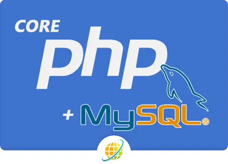

<h1 align="center"><a href="https://mercuryt.mercury-training.com" target="_blank" style="font-size: 84px; color: black;">COURSE-FACTORY</a></h1>

Developed with ❤️ by Iyad Sammour fullstack WEB developer using

## About Course Factory

We strive to be creative in all of its manifestations.
### Our Story
It is incredibly challenging to thrive as a startup or even a major corporation in
one of the most competitive fields if you are not up to date on the most recent
business growth strategies and trends. To grow your business in the current era, you must go digital.

SAWTRU BOOST is officially operating in various locations around the world,
with our headquarters in Istanbul, Turkey, as a business development and
marketing agency under the umbrella of SAWTRU INTERNATIONAL. Our team
of highly qualified experts has developed a unique approach to accompanying
you on your growth journey, offering a variety of marketing and business studies
services and solutions. ( Read More about our <a href=" https://sawtruboost.com/files/Sawtruboost_Company_Profile.pdf " target="_blank">Company Profile</a> )

### Who We Are

Our Boosters are a mix of Palestinian, Saudi, Syrian, Sudanese, Egyptian, Jordanian, Lebanese, Belgian, and Turks nationalities and cultures who have come together to create a professional team with the common goal of producing the most authentic work for our clients. We literally create brilliance with such diverse perspectives. ( Meet our <a href="https://sawtruboost.com/people">Team</a> )

### What We Do

We collaborate with you from concept to accomplishment to achieve ntransformational growth. We begin with our tried-and-true Growth strategies and advance to a series of services that will nassist you in understanding, planning,and executing transformational growth. ( Explore More About <a href="https://sawtruboost.com/services">Our Magical Boosts</a> )

## What is inside this project

### Dashboard:

the dashboard is combination of user administration, blog mangement, crm management

#### User Management
Users has roles which can e manage easialy with role management section

they have privacy to to show their profile in the people page 

they have name with its translation with three defferent languages (Arabic, English and turkish).

this page is to be upgraded soon to have teams and hr management info.

profile picture

#### blogs

blogs page has first the list of posts

there is a button that is used for privacy, if public it will be shown in the latest posts page otherwise it will be hidden

each blog has its own tranlsation and SEO (keywords and description) will be shown in the header of the page.

