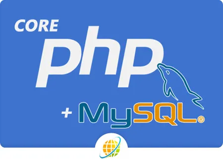

<h1 align="center"><a href="https://mercuryt.mercury-training.com" target="_blank" style="font-size: 84px; color: black;">COURSE-FACTORY</a></h1>

Developed with ❤️ by Iyad Sammour fullstack WEB developer using

## About Course Factory

